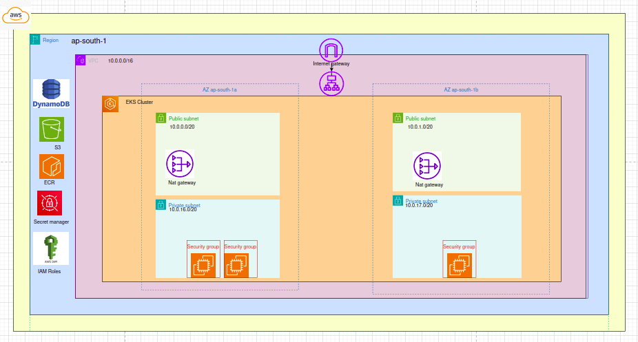
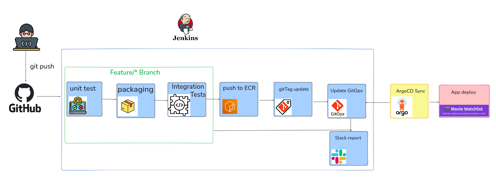

# Movie Watchlist Web Application

Full-stack movie watchlist application deployed on AWS with complete CI/CD pipeline and GitOps workflow.

## Architecture




## Tech Stack

**Application:**
- Backend: Flask (Python)
- Database: MongoDB
- Frontend: HTML/CSS/JavaScript
- Web Server: Nginx

**Infrastructure:**
- Cloud: AWS (EKS, VPC, IAM)
- IaC: Terraform
- Orchestration: Kubernetes + Helm
- GitOps: ArgoCD
- CI/CD: Jenkins + GitHub Actions
- Monitoring: Prometheus, Grafana, ELK Stack

## Project Structure
```
├── Diagrams/                    # Architecture diagrams
├── The-repo's/
│   ├── movie-watchlist-app/     # Application code
│   ├── movie-watchlist-gitops/  # Kubernetes manifests & Helm charts
│   └── movie-watchlist-infrastructure/  # Terraform modules
└── project-pictures/            # Screenshots
```

## Features

- Add, view, and manage movie watchlist
- Containerized with Docker
- Auto-scaling with Kubernetes HPA
- SSL/TLS with cert-manager
- Centralized logging (ELK)
- Metrics & monitoring (Prometheus/Grafana)
- GitOps deployment workflow

## Deployment

Infrastructure provisioned with Terraform on AWS EKS. Application deployed via ArgoCD using GitOps principles.

